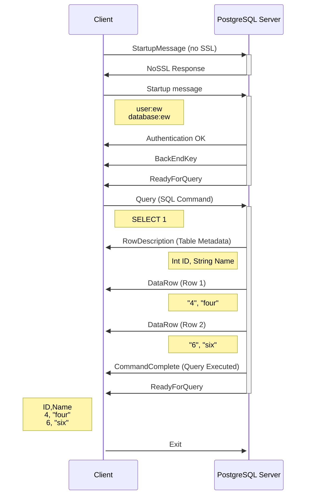

# pgres serve

Using the references of https://gavinray97.github.io/blog/postgres-wire-protocol-jdk-21 and the excellent documentation of the Postgresql wire protocol https://www.postgresql.org/docs/current/protocol.html and https://www.postgresql.org/docs/current/protocol-message-formats.html, I implemented here a C# minimal console application that responds to a command line psql query. 

- No SQL parsing is done.
- Currently responding only with static data.
- No Auth
- No SSL

## usage

In one terminal (on tested Ubuntu 23.10), running the server - once connected you should see the following output: 

```
dotnet run
Listening for connections on port 5432...
Connection accepted from 127.0.0.1:56278.
Received data from client:?/
Received SSL Request
Received data from client: Huserewdatabaseewapplication_namepsqlclient_encodingUTF8
Received Startup Message
Key = user, Value = ew
Key = database, Value = ew
Key = application_name, Value = psql
Key = client_encoding, Value = UTF8
Received data from client: QSELECT 1;
Received Query Message : SELECT 1;
rowDescription length = 51
54 00 00 00 32 00 02 69 64 00 00 00 00 00 00 00 00 00 00 17 00 04 FF FF FF FF 00 00 6E 61 6D 65 00 00 00 00 00 00 00 00 00 00 19 FF FF FF FF FF FF 00 00
DataRow1 length = 20
44 00 00 00 13 00 02 00 00 00 01 34 00 00 00 04 66 6F 75 72
DataRow1 length = 19
44 00 00 00 12 00 02 00 00 00 01 36 00 00 00 03 73 69 78
cc length = 14
43 00 00 00 0D 53 45 4C 45 43 54 20 32 00
return ready for query
Received data from client: X
Received Exit Message
```

In second terminal 

```
 psql --host=localhost -c "SELECT 1;" -e -E
SELECT 1;
 id | name
----+------
  4 | four
  6 | six
(2 rows)
```

Here's the overview



To get the psql client: 

```bash
sudo apt-get update
sudo apt-get install postgresql-client
```


